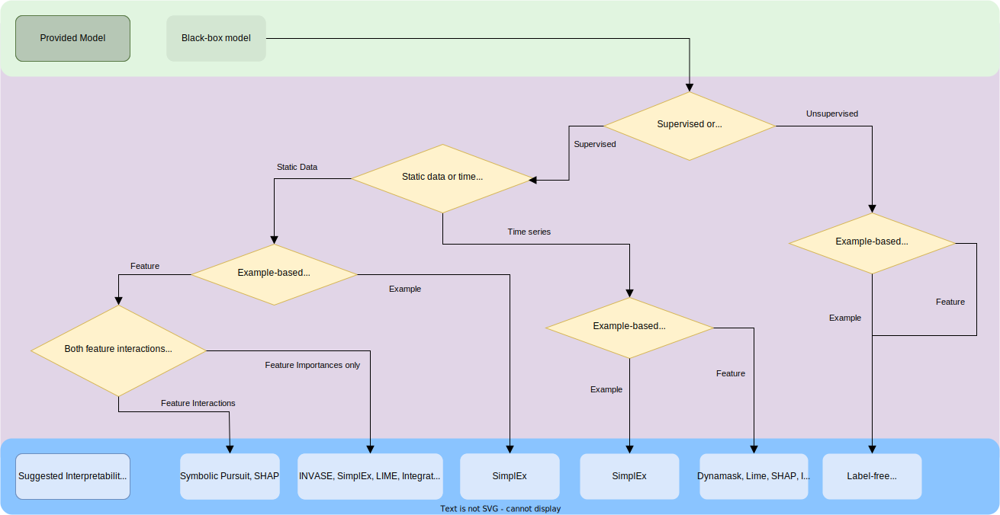

# Machine Learning Interpretability Methods

This repository collects different Machine Learning interpretability methods and aims to act
as a reference where the user can select the method best suited for their needs. All the methods
aim to provide an insight into why a machine learning model has made a given prediction.
This is critical because for a model's predictions to be trusted they must be understood.

# Table of Contents
0. [Background](#background)
1. [Exaplainers](#explainers)
    - [Selecting the Right Interpretability Method](#selecting-the-right-interpretability-method)
2. [Explainers By Model Type](#explainers-by-model-type)
    - [Tabular Data Model Explainers](#tabular-data-model-explainers)
    - [Time Series model Explainers](#time-series-model-explainers)
    - [Clustering Model Explainers](#clustering-model-explainers)
3. [Generalized and Personalized Explainers](#generalized-and-personalized-explainers)
    - [Generalized Explainers](#generalized-explainers)
    - [Personalized Explainers](#personalized-explainers)

# Background

The Machine Learning (ML) community has produced incredible models for making highly
accurate predictions and classifications across many fields. However, uptake of these models into
settings outside of the ML community faces a key barrier: Interpretability. If a human cannot
understand why a decision has been made by a machine, they cannot be reasonably expected to act
on that decision with full confidence, particularly in a high-stakes environment such as medicine.
Therefore making the decisions of "Black-Box" models more transparent is of vital importance. For more
information see this [blog post](https://www.vanderschaar-lab.com/interpretable-machine-learning/). 

This GitHub repository aims to act as a home for interpretability methods, where the state-of-the-art models
can be found for every application. All the linked van der Schaar Lab repositories on this page are pytorch compatible.
Pytorch versions of the other methods are available on public libraries, such as [captum](https://captum.ai/).

# Explainers

Different model architectures can require different interpretability models, or "Explainers".
Below are all the explainers included in this repository, with links to their source code and the papers that introduced them.

| Explainer | Affiliation | GitHub | Paper | Date of Paper |
| ----------- | ----------- | ----------- | ----------- | ----------- |
| Label-Free XAI | [van der Schaar Lab](https://www.vanderschaar-lab.com/) | [Label-Free XAI Source Code](https://github.com/JonathanCrabbe/Label-Free-XAI) | [Label-Free XAI Paper](https://arxiv.org/abs/2203.01928) | 2022|
| SimplEx | [van der Schaar Lab](https://www.vanderschaar-lab.com/)  | [SimplEx Source Code](https://github.com/vanderschaarlab/Simplex) | [SimplEx Paper](https://papers.nips.cc/paper/2021/hash/65658fde58ab3c2b6e5132a39fae7cb9-Abstract.html) | 2021 |
| Dynamask | [van der Schaar Lab](https://www.vanderschaar-lab.com/) | [Dynamask Source Code](https://github.com/JonathanCrabbe/Dynamask) | [Dynamask Paper](https://arxiv.org/abs/2106.05303) | 2021 |
| Symbolic Pursuit | [van der Schaar Lab](https://www.vanderschaar-lab.com/) | [Symbolic Pursuit Source Code](https://github.com/JonathanCrabbe/Symbolic-Pursuit) | [Symbolic Pursuit Paper](https://arxiv.org/abs/2011.08596#:~:text=Learning%20outside%20the%20Black%2DBox%3A%20The%20pursuit%20of%20interpretable%20models,-Jonathan%20Crabb%C3%A9%2C%20Yao&text=Machine%20Learning%20has%20proved%20its,difficulties%20of%20interpreting%20these%20models.) | 2020 |
| INVASE |  [van der Schaar Lab](https://www.vanderschaar-lab.com/)  | [INVASE Source Code](https://github.com/vanderschaarlab/INVASE) | [INVASE Paper](https://openreview.net/forum?id=BJg_roAcK7) | 2019 |
| SHAP |  University of Washington | [SHAP Source Code](https://github.com/slundberg/shap) (pytorch implementation: [Captum GradientShap](https://captum.ai/api/gradient_shap.html))| [SHAP Paper](https://papers.nips.cc/paper/2017/hash/8a20a8621978632d76c43dfd28b67767-Abstract.html) | 2017 |
| Integrated gradients | Google | [Integrated Gradient Source Code](https://github.com/ankurtaly/Integrated-Gradients)  (pytorch implementation: [Captum Integrated Gradients](https://captum.ai/docs/extension/integrated_gradients))| [Integrated Gradient paper](https://arxiv.org/abs/1703.01365) | 2017 |
| LIME |  University of Washington | [LIME Source Code](https://github.com/marcotcr/lime)  (pytorch implementation: [Captum Lime](https://captum.ai/api/lime.html))| [LIME Paper](https://arxiv.org/abs/1602.04938) | 2016 |

## Selecting an Interpretability Method

Figure 1 shows a flowchart to help with the process of selecting the method that is most appropriate for your project.

*Figure 1: Interpretability Method selection flowchart.*

# Explainers By Model Type

The following sections break the methods down by the type of model that they explain.

## Tabular Data Model Explainers

There are many different static tabular data explainers, giving many different options to choose between. These methods are list below with the inputs required to use them.

| Explainer | Inputs | Notes | 
| ----------- | ----------- | ----------- | 
| SimplEx | The latent representation of records from the predictive model. | It is worth noting that SimplEx appears in both this and the following section as it can be easily implemented for either tabular data or time series data. |
| Symbolic Pursuit | The training data and corresponding model predictions. | This method has the benefit of producing a mathematical expression that approximates the predictive model. This seeks to discover “rules” and “laws” learned by the machine model. |
| INVASE | The training data and corresponding model predictions, with which to train a selector network. | Currently, INVASE has only been implemented for tabular data, but it could be extended to include time series explanations with some further work, see Section 5 of the paper linked above, "Future Work". |
| SHAP | The predictive model and training data from which to subsequently calculate Shapley values. ||
| Integrated gradients | The predictive model and its gradients. ||
| LIME | The predictive model from which to calculate weights in a local linear model . ||

## Time Series model Explainers

The following Explainers work with models for making predictions from time series data.

| Explainer | Inputs | Notes | 
| ----------- | ----------- | ----------- | 
| Dynamask | The predictive model and its gradients. | Dynamask calculates feature importance at every time steps for each feature. This is advantageous over other saliency methods, such as SHAP and Integrated Gradients were optimized for static data then later extended to time series. They are thus static, and hence the context, is forgotten when treating all the time steps as separate features. |
| SimplEx | The latent representation of records from the predictive model. | It is worth noting that SimplEx appears in both this and the following section as it can be easily implemented for either tabular data or time series data. |
| SHAP | The predictive model and training data from which to subsequently calculate Shapley values. | SHAP and Integrated Gradients can both be used for time series, however their efficacy in this setting has been criticized in [this paper](https://papers.nips.cc/paper/2020/hash/47a3893cc405396a5c30d91320572d6d-Abstract.html). |
| Integrated gradients | The predictive model and its gradients. | SHAP and Integrated Gradients can both be used for time series, however their efficacy in this setting has been criticized in [this paper](https://papers.nips.cc/paper/2020/hash/47a3893cc405396a5c30d91320572d6d-Abstract.html). |
| LIME | The predictive model from which to calculate weights in a local linear model .  | Lime has been extended to work with time series data with libraries such as Lime-For-Time. |

## Clustering Model Explainers

The following Explainers work with unsupervised clustering ML models, that is to say those without labelled data in the training set.

| Explainer | Inputs |  
| ----------- | ----------- |
| Label-Free XAI | The predictive model. |

# Feature-based and example-based Explainers

Increased interpretability of a model can be achieved in multiple ways. Generalized methods
may provide an explanation for a model's predictions in terms of the features that were important
for that decision, e.g. a predicted value yi was given because feature 1 was high and
feature 3 was low for the ith prediction record. Whereas, personalized methods may provide their
explanation by showing examples that were important to the prediction, e.g. a predicted value
yi was given because the model had previously seen three records with a similar profile
they all had the same label as the predicted value here.

SimplEx is worthy of note in this section as it bridges the gap between these two categories by
providing example importances and the features that are important for those examples. It therefore
appears in both sections below.

## Feature-based Explainers

Feature-based explainers have the advantage of specifically telling you the features that are important
for a prediction for a given record. These explainers are useful at several points in the development cycle of black-box models. 
They are useful when debugging a model, because they can reveal places where the model is relying
too heavily on fields which you know should be of lesser importance. It is also useful for feature
engineering as you can directly see which features are being used the most.

The following explainers provide feature importances for a given prediction. 

| Explainer | Inputs | Notes | 
| ----------- | ----------- | ----------- | 
| SimplEx | The latent representation of records from the predictive model. | SimplEx is the first method, to our knowledge, to calculate both feature importance and example importance. It calculates the importance of each feature in each of the examples in the explanation in order to reveal why the model sees the test record as similar to those in the explanation. |
| Dynamask | The predictive model and its gradients. | Dynamask calculates feature importance at every time steps for each feature, without treating time steps as independent features.|
| INVASE | The training data and corresponding model predictions, with which to train a selector network. |  |
| Symbolic Pursuit | The training data and corresponding model predictions. | Symbolic Pursuit calculates feature interactions as well as feature importances. It has the benefit of producing a mathematical expression that approximates the predictive model. <TODO how is this useful> |
| SHAP | The predictive model and training data from which to subsequently calculate Shapley values. |  SHAP calculates feature interactions as well as feature importances.  |
| Integrated gradients | The predictive model and its gradients. |  |
| LIME | The predictive model from which to calculate weights in a local linear model .  |  |

## Example-based Explainers

Example-based explainers show the user example records that the model sees as being similar. They can be
useful for debugging in two ways: 1) if the explainer reveals that two examples are being viewed by the
model as similar, but the user disagrees, this can be indicative of a model not classifying records correctly;
2) if the explainer states the most similar examples (from the models perspective) are incorrectly classified that
also casts doubt on the validity of the predition for the test record.

The following explainers provide example importances for a given prediction.

| Explainer | Inputs | Notes | 
| ----------- | ----------- | ----------- |
| Label-Free XAI | The predictive model. ||
| SimplEx | The latent representation of records from the predictive model. | SimplEx is the first method, to our knowledge, to calculate both feature importance and example importance. It calculates the importance of each feature in each of the examples in the explanation in order to reveal why the model sees the test record as similar to those in the explanation. |

